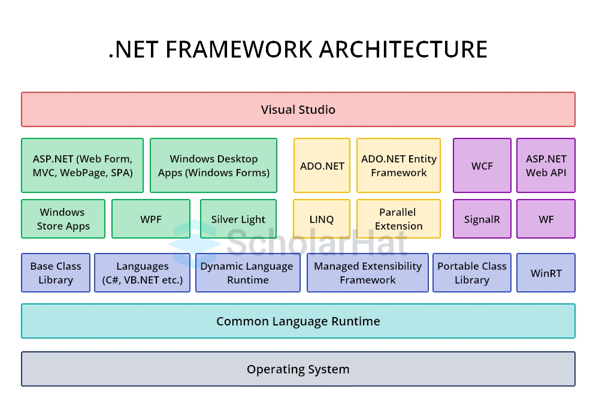
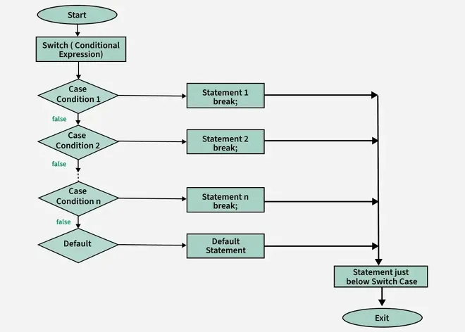

# Unit 1: Introduction to .NET and C#

This unit delves deeply into the foundational elements of the .NET ecosystem and the C# programming language. We'll expand on each subtopic with detailed explanations, elaborated terms, additional analogies, more comprehensive code examples, and relevant images to visualize concepts. The goal is to provide a thorough understanding, making abstract ideas more tangible. Weightage: 10%, Teaching hours: 5.

## 1.1 Overview of .NET Framework

### Core Concepts (Elaborated)
- **.NET Framework**: This is a comprehensive software development platform created by Microsoft, initially released in 2002. It provides a controlled environment for building, deploying, and running applications and services that use .NET technologies. Key features include support for multiple programming languages (like C#, VB.NET, F#), a vast library of pre-built classes for common tasks (e.g., file I/O, networking), and tools for web, desktop, mobile, and cloud development. As of December 2025, the classic .NET Framework (up to version 4.8) is still supported for legacy Windows apps, but it's largely superseded by the unified .NET platform.

- **.NET Core**: Introduced in 2016 as an open-source, cross-platform alternative to the .NET Framework. It's modular, meaning you can include only the components you need, reducing footprint and improving performance. It supports Windows, macOS, Linux, and even embedded systems like IoT devices. Key advantages: faster startup times, side-by-side versioning (multiple versions on one machine without conflicts), and containerization support (e.g., Docker for microservices).

- **Unified .NET (.NET 5+)**: Starting from .NET 5 in 2020, Microsoft unified the platforms into a single ".NET" brand. By 2025, we're on .NET 9 or 10, which combines the best of Framework and Core. It includes workloads for web (ASP.NET Core), desktop (WinForms, WPF, MAUI for cross-platform), cloud (Azure integration), gaming (via Unity or Godot plugins), and AI/ML (ML.NET for machine learning models). This unification eliminates confusion and allows seamless migration.

- **Common Language Runtime (CLR)**: The heart of .NET, acting as a virtual machine that executes managed code. It handles memory allocation, thread management, exception handling, and security. CLR ensures type safety (preventing operations on incompatible types) and just-in-time (JIT) compilation, where Intermediate Language (IL) code is converted to native machine code at runtime for optimal performance.

- **Managed Code**: Code that runs under the CLR's supervision. It's compiled from source (e.g., C#) to IL (also called MSIL or CIL), which is platform-agnostic. Benefits: automatic garbage collection (reclaiming memory from unused objects), bounds checking (preventing array overflows), and exception handling.

- **Framework Class Library (FCL) or Base Class Library (BCL)**: A massive collection of reusable classes, interfaces, and value types. Organized into namespaces like System.IO for file operations, System.Net for networking, and System.Collections for data structures. In modern .NET, it's expanded with NuGet packages for extensibility.

- **Assemblies**: The deployment units in .NET, essentially compiled code files (.dll for libraries, .exe for executables). They contain metadata (version info, dependencies) and can be private (app-specific) or shared (in Global Assembly Cache - GAC). Strong naming with digital signatures prevents tampering.

- **Namespaces**: Logical groupings of types to avoid name collisions. For example, System.Console is in the System namespace. You import them with `using` directives to shorten code.

- **Garbage Collection (GC)**: An automatic memory management system that identifies and frees memory occupied by objects no longer in use. It runs in generations (Gen0 for short-lived, Gen2 for long-lived objects) to optimize performance, reducing pauses in applications.

- **Just-In-Time (JIT) Compilation**: Converts IL to native code on-the-fly. Types include Tiered Compilation (quick initial compile, optimize later) and Ahead-of-Time (AOT) for startup speed in .NET Native or Blazor WebAssembly.

- **Security Features**: Code Access Security (CAS) in older Framework, now evolved to role-based security, encryption APIs, and AppDomains for isolation (though less used in Core).

### Analogies (Expanded)
- Imagine .NET as a modern city infrastructure: The CLR is the city mayor overseeing operations, ensuring safety (type safety) and cleanliness (garbage collection). The FCL is like public libraries and utilities—ready-made resources for citizens (developers). Assemblies are prefabricated buildings you can plug in, and namespaces are zip codes organizing addresses.

- If programming platforms were vehicles: .NET Framework is a sturdy truck optimized for heavy Windows loads; .NET Core is a nimble electric bike for any terrain; unified .NET is a high-speed train connecting everything efficiently.

### Why It Matters
- In 2025, .NET powers enterprise apps (e.g., banking systems), web services (Azure Functions), and even AI integrations (with ONNX for model runtime). Its cross-platform nature makes it ideal for hybrid workforces, and open-source community (GitHub) drives rapid evolution.

To visualize the structure, here's a diagram of the .NET architecture:


Another perspective on the layered architecture:



## 1.2 Introduction to C#

### Core Concepts (Elaborated)
- **C# (C-Sharp)**: A statically-typed, multi-paradigm language designed by Anders Hejlsberg at Microsoft. Released in 2000 as part of .NET, it's influenced by C++, Java, and Delphi. Supports object-oriented (classes, inheritance), functional (lambdas, immutability), imperative (step-by-step commands), and declarative (LINQ for data queries) programming.

- **Type Safety**: Ensures variables are used consistently (e.g., can't add string to int without conversion), catching errors at compile-time.

- **Automatic Memory Management**: Via GC, developers don't manually allocate/free memory, reducing bugs like leaks or dangling pointers.

- **Language Integrated Query (LINQ)**: A set of extensions for querying collections, databases, XML—uniformly. Example: `from p in products where p.Price > 100 select p;`

- **Async/Await**: Keywords for asynchronous programming, making non-blocking code readable like synchronous (e.g., awaiting API calls without freezing UI).

- **Evolution Highlights**: C# 1.0 (basic OOP), C# 3.0 (LINQ), C# 5.0 (async), C# 9.0 (records for immutable data), C# 12/13 (2025: enhanced pattern matching, primary constructors). Modern features like nullable reference types prevent null exceptions.

- **Use Cases**: Backend web (ASP.NET), games (Unity uses C# scripting), desktop (Electron-like with .NET MAUI), mobile (Xamarin/MAUI), and embedded (IoT with .NET nanoFramework).

### Analogies (Expanded)
- C# is like a Swiss Army knife: Versatile tools for different tasks—OOP blade for structure, functional for precision cuts, async for multitasking without tangling.

- Compared to languages: If Python is a casual bicycle (easy but slower for big trips), C# is a geared mountain bike—powerful, safe (helmets via type safety), and efficient for long hauls (enterprise apps).

### Code Example (Expanded)
A detailed "Hello World" with explanations:
```csharp
using System;  // Imports System namespace for Console class

namespace HelloWorld {  // Organizes code; prevents name clashes
    class Program {  // Class: Blueprint for objects; here, container for Main
        static void Main(string[] args) {  // Entry point; static: no instance needed; args: command-line params
            Console.WriteLine("Hello, World!");  // Writes to console; WriteLine adds newline
            Console.ReadKey();  // Pauses for key press to see output
        }
    }
}
```
- Compilation: `csc HelloWorld.cs` or via IDE. Runs as `HelloWorld.exe`.

Here's an example of C# syntax in action:


Another syntax illustration:


## 1.3 Environment Setup

### Core Concepts (Elaborated)
- **Integrated Development Environment (IDE)**: Visual Studio (VS) is Microsoft's flagship—full-featured with debugging, IntelliSense (auto-complete), refactoring tools. VS Community is free for individuals/small teams. For lightweight: Visual Studio Code (VS Code), open-source, extensible via extensions (C# by Microsoft).

- **.NET SDK**: Software Development Kit including CLI tools (dotnet command), runtime, and libraries. Install from dotnet.microsoft.com—supports multi-targeting (build for .NET 6, 8, etc.).

- **Installation Steps (Detailed)**:
  1. Download .NET SDK (e.g., .NET 9 installer for Windows/macOS/Linux).
  2. Install VS 2022/2025 or VS Code + C# extension.
  3. Verify: Open terminal, run `dotnet --version` (should show latest).
  4. Create project: `dotnet new console -o MyApp` (creates folder with .csproj, Program.cs).
  5. Build/Run: `dotnet build` (compiles), `dotnet run` (executes).

- **Additional Tools**: Rider (JetBrains IDE), Git for version control, NuGet for package management (e.g., `dotnet add package Newtonsoft.Json`).

- **Debugging**: Set breakpoints (F9 in VS), step through (F10/F11), inspect variables in Locals window.

- **Cross-Platform Considerations**: On Linux/macOS, use VS Code or command-line; VS for Mac is available but phasing out for VS Code focus.

### Analogies (Expanded)
- Setting up is like equipping a workshop: SDK is the power tools, IDE is the workbench with organized drawers (project explorer), debugger is the magnifying glass for inspections.

### Practical Tips
- Use extensions: OmniSharp for VS Code C# support. Enable .NET Interactive for notebooks (Jupyter-like in VS Code).

Visualize the setup:


Setup screen example:


## 1.4 Basic Syntax

### Basic Syntax & Structure Detailed Breakdown**

Every C\# program must follow a strict hierarchy. You cannot just start typing code at the top of a file like in Python.

**The Hierarchy Explained:**

1.  **Namespace:**

      * *Concept:* Logical grouping of related classes.
      * *Elaboration:* Imagine you are building a massive application with 10,000 files. You might have a class called `User` for logging in, and another class called `User` for database management. If they were all in one pile, the computer wouldn't know which `User` you meant.
      * Namespaces act like folders on your hard drive. You can have `LoginSystem.User` and `DatabaseSystem.User`.

2.  **Class:**

      * *Concept:* A blueprint for an object. Every line of C\# code (methods and variables) *must* live inside a class.

3.  **Method (Function):**

      * *Concept:* A reusable block of code that performs a specific action.

4.  **The `Main` Method:**

      * *Concept:* The entry point.
      * *Elaboration:* When the CLR tries to run your program, it looks for a method specifically named `Main`. That is where execution begins.

**Detailed Code Analysis:**

```csharp
// 1. USING DIRECTIVES
// This tells C# to look in the "System" aisle of the FCL pantry.
// Without this, we couldn't use 'Console' directly; we would have to type 'System.Console' every time.
using System;

// 2. NAMESPACE DECLARATION
// We are creating a named container for our new application.
namespace MyFirstDetailedApp
{
    // 3. CLASS DECLARATION
    // The container for our program's data and behaviors.
    // 'Program' is just a standard name, it could be anything.
    class Program
    {
        // 4. THE MAIN METHOD - THE ENTRY POINT
        // static: Means this method belongs to the blueprint itself, not a specific instance of the blueprint.
        // void: Means this method does not return any resulting data when it finishes.
        // Main: The special name the CLR looks for.
        // string[] args: Allows the program to accept command-line arguments when launched.
        static void Main(string[] args)
        {
            // CONSOLE OUTPUT
            // Console is a class inside the 'System' namespace.
            // WriteLine is a method inside the Console class that prints text and a new line character.
            Console.WriteLine("Hello! Welcome to detailed .NET.");

            // VARIABLE DECLARATION AND TYPE SAFETY
            // We declare that 'age' can ONLY hold integer whole numbers.
            int age;

            // CONSOLE INPUT
            Console.Write("Please enter your age: ");
            // ReadLine waits for the user to type text and hit enter. It ALWAYS returns a string.
            string inputString = Console.ReadLine();

            // CONVERSION
            // Because C# is type-safe, we cannot just say 'age = inputString'.
            // We must explicitly convert the text "25" into the number 25.
            age = Convert.ToInt32(inputString);

            Console.WriteLine("Next year you will be: " + (age + 1));

            // Pauses screen so you can read the output
            Console.ReadKey();
        } // End of Main method scope
    } // End of Program class scope
} // End of Namespace scope
```


### Core Concepts (Elaborated)
- **Variables**: Containers for data. Declaration: type name = value; e.g., `int count = 0;`. Types: Primitives (int, double, char, bool), strings (immutable sequences), arrays (fixed-size collections).

- **Data Types**: Value types (structs, enums—stored on stack, fast), Reference types (classes, interfaces—heap-allocated, can be null).

- **Control Structures**:
  - **If-Else**: Conditional branching. Nested for complex logic.
  - **Switch**: Multi-way branch based on value; supports patterns in modern C#.
  - **Loops**: For (counter-based), While (condition-pre), Do-While (condition-post), Foreach (iterate collections).

- **Methods**: Reusable code blocks. Parameters (pass by value/ref), return types (void or specific). Overloading: same name, different params.

- **Operators**: Arithmetic (+,-), Comparison (==, >), Logical (&&, ||), Assignment (=, +=).

- **Comments**: `//` single-line, `/* */` multi-line, `///` XML for docs.

- **Formatting**: Indentation for readability; use { } for blocks.

### Analogies (Expanded)
- Variables: Labeled jars in a pantry—hold specific items (data types).
- Control structures: Road signs—if-else is a fork in the road, loops are roundabouts repeating until exit condition.

### Code Examples (Expanded)
- Variables and If-Else:
```csharp
string name = "Alice";  // String: Sequence of characters
int age = 30;  // Int: 32-bit integer
if (age >= 18 && !string.IsNullOrEmpty(name)) {  // Logical AND, method call
    Console.WriteLine($"{name} is an adult.");  // String interpolation
} else {
    Console.WriteLine("Invalid or minor.");
}
```
- Switch:
```csharp
int day = 3;
switch (day) {
    case 1: Console.WriteLine("Monday"); break;
    case 2: case 3: Console.WriteLine("Midweek"); break;  // Fall-through
    default: Console.WriteLine("Weekend"); break;
}
```
- For Loop with Array:
```csharp
string[] fruits = { "Apple", "Banana", "Cherry" };  // Array declaration
for (int i = 0; i < fruits.Length; i++) {
    Console.WriteLine(fruits[i]);
}
```
- Method with Params:
```csharp
static double CalculateArea(double radius) {  // Method signature
    return Math.PI * radius * radius;  // Using System.Math
}
// Usage: double area = CalculateArea(5.0); // 78.54
```

Flowchart for control structures:


Switch statement flowchart:



